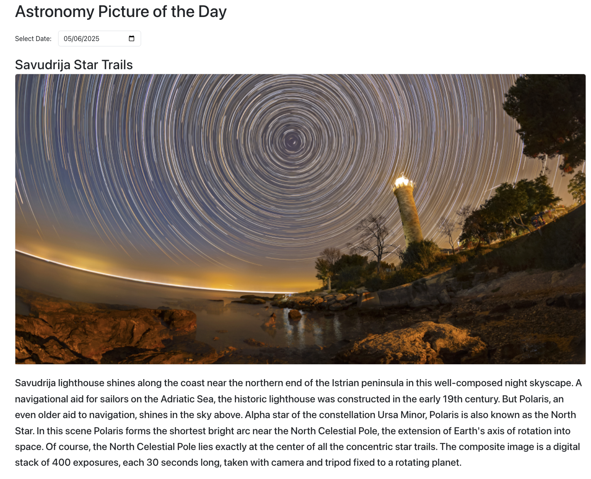

# 🚀 NASA Explorer

Explore NASA’s open APIs with a sleek, modern React frontend and Express backend.

## 🌐 Live Demo

- **Frontend**: [https://nasa-frontend-kpp6.onrender.com](https://nasa-frontend-kpp6.onrender.com)  
- **Backend**: [https://nasa-backend-6asb.onrender.com](https://nasa-backend-6asb.onrender.com)

---

## 🔧 Tech Stack

- **Frontend**: React + Bootstrap
- **Backend**: Node.js + Express
- **API**: [NASA Open APIs](https://api.nasa.gov/)
- **Hosting**: Render

---

## ✅ Public API Routes (Proxy to NASA Open APIs)

| Method | Endpoint                                                              | Description                                      |
|--------|-----------------------------------------------------------------------|--------------------------------------------------|
| GET    | `/api/apod?date=YYYY-MM-DD`                                           | Fetch Astronomy Picture of the Day by date       |
| GET    | `/api/epic?date=YYYY-MM-DD`                                           | Fetch Earth EPIC satellite data by date          |
| GET    | `/api/mars?rover=name&date=YYYY-MM-DD`                                | Fetch Mars Rover photos by rover & date          |
| GET    | `/api/neows?start_date=YYYY-MM-DD&end_date=YYYY-MM-DD`               | Fetch NEO asteroid data in date range            |
| GET    | `/api/library?q=searchTerm`                                           | Search NASA Image and Video Library              |

> All endpoints are unauthenticated. Query parameters are required for date-based APIs.

---

## 🛠️ API Endpoint Details (Backend Logic from `server.js`)

| Method | Endpoint       | Description                                |
|--------|----------------|--------------------------------------------|
| GET    | `/api/apod`    | Proxy to NASA's Astronomy Picture API      |
| GET    | `/api/epic`    | Proxy to NASA's EPIC satellite API         |
| GET    | `/api/mars`    | Proxy to NASA's Mars Rover Photo API       |
| GET    | `/api/neows`   | Proxy to NASA's NEO Web Service            |
| GET    | `/api/library` | Proxy to NASA's Image & Video Search API   |

---

## 🛰 Features Overview

### 1. Astronomy Picture of the Day (APOD)
Select a date and view NASA’s featured space image.  



---

### 2. Earth Polychromatic Imaging Camera (EPIC)
View Earth satellite images from DSCOVR on a selected date, including geospatial and motion data.  


---

### 3. Mars Rover Photos
Choose a rover (e.g. Curiosity) and Earth date to browse high-res Mars surface images.  


---

### 4. Near Earth Object Web Service (NeoWs)
Check upcoming asteroid passes with size, distance, and danger indicators.  


---

### 5. NASA Image and Video Library
Search historical photos and videos from NASA’s rich multimedia archive.  
  


---

## ⚙️ How to Run Locally

### 1. Clone the repository

```bash
git clone https://github.com/your-username/nasa-explorer.git
cd nasa-explorer
```

### 2. Install dependencies

```bash
npm install
```

### 3. Run backend

```bash
node server.js
```

### 4. Run frontend

```bash
cd frontend
npm install
npm start
```

---

## ⚠️ Notes

- NASA APIs occasionally fail due to rate limits or missing data for some dates — this is expected.
- Make sure your NASA API key is valid and not expired (stored in `.env`).
- Free hosting on Render may take 20-30 seconds cold start time.

---
